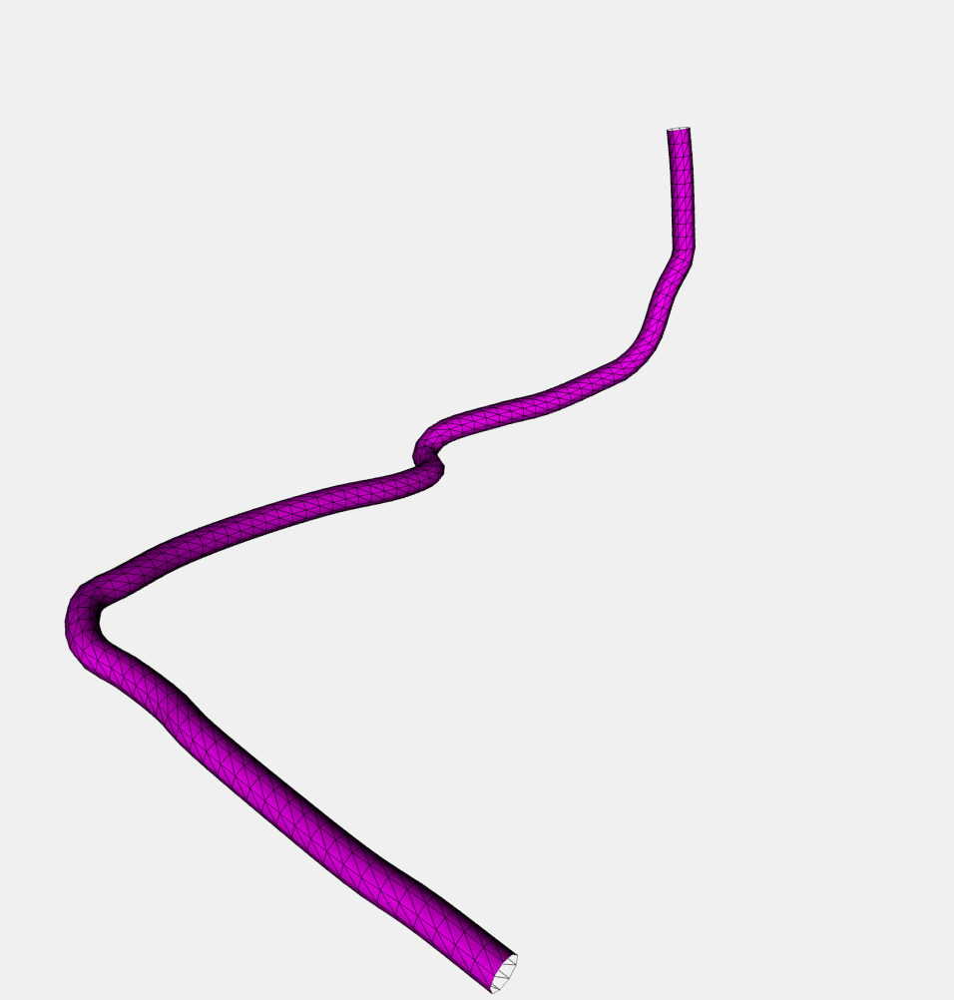
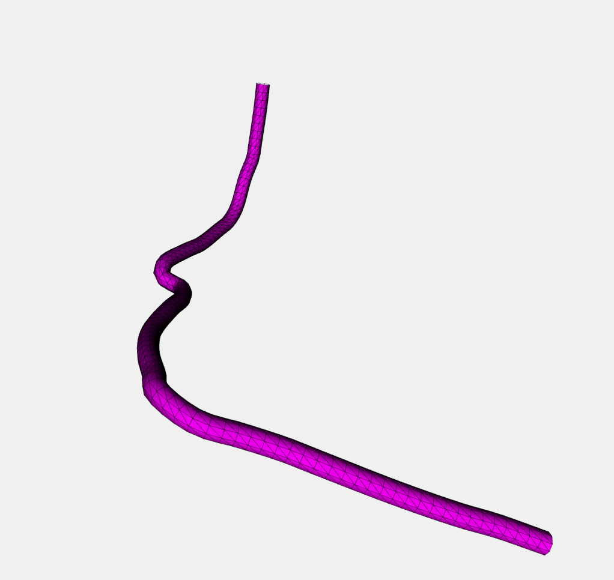
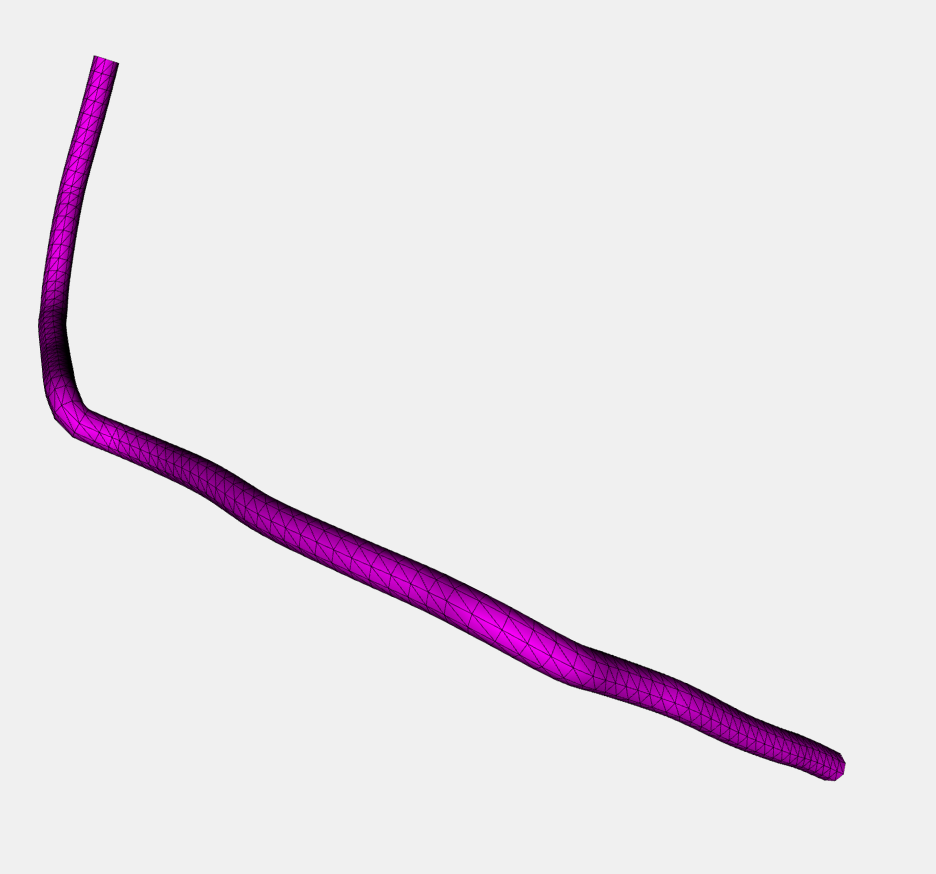
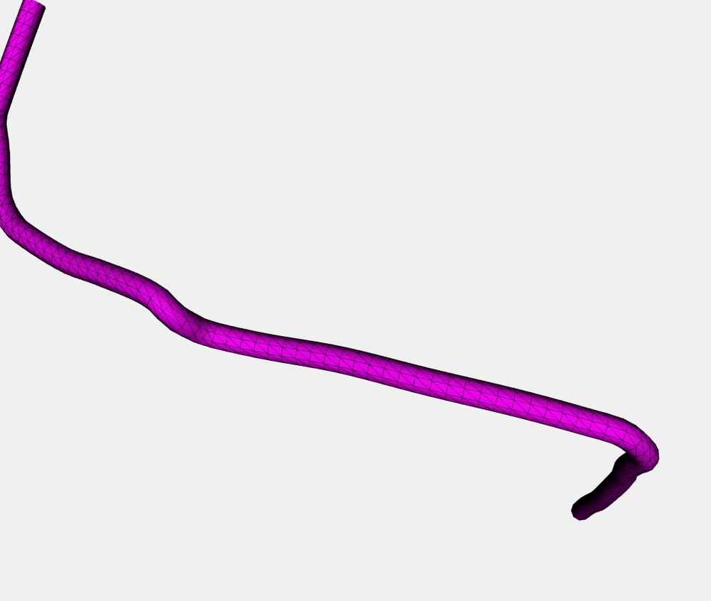
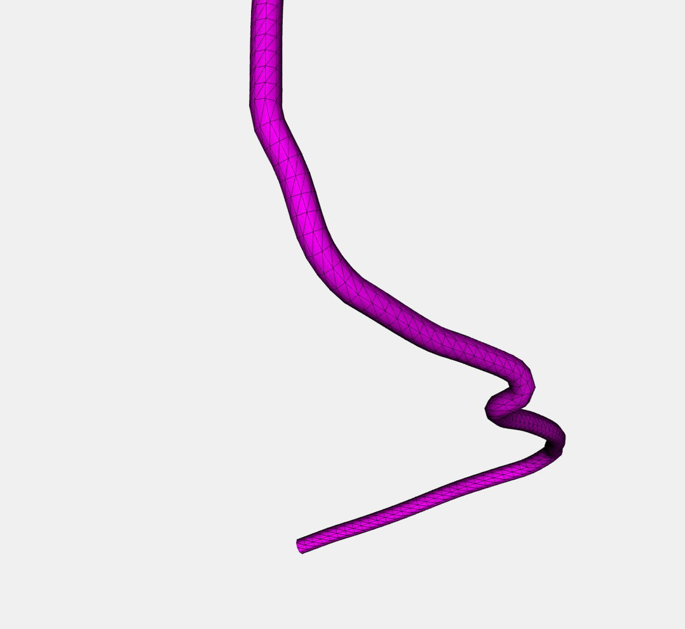

# Ski-api

Ski-api is a simple api allowing to retrieve data from a json containing data related to ski slopes.

## Install

1. get the source code
2. run the following command to install node dependencies

```sh
  npm install
```

## Use

use the following command to start your server

```sh
  npm start
```

you can now query your local local server at the following uri : http://localhost:3000

# Endpoints

there are 2 endpoints. the first is /off-pistes

## /off-pistes

It allows to display all or filter slopes. You can pass 2 parameters:

### Query:

The query parameter allow you to filters the slopes. The query is composed of 3 elements, an attribute name, an operator and a value.
let's see 2 exemples of queries

1. query=name.like(`*couloir`\*)
   It allows to search slopes where the name is like couloir ( it’s like an sql like. so here it means a name containing the word "couloir. It’s case insensitive.
2. query=ski_difficulty=2
   It allows to search the slopes having a ski difficulties equals to 2.

Only those 2 operators are available at the moment.

### Sort:

The sort parameter allow you to sort on an attribute. Give an attribute name to sort on this attribute. By default sort is ascending. for descending sort, you have to pass -attrName.
examples:
sort=-name will perform a descending sort by name
sort=id will perform an ascending sort by id

### puting all together

http://localhost:3000/off-pistes?query=name.like(``*couloir``*)&sort=-name
http://localhost:3000/off-pistes?query=ski_difficulty=2

The second endpoint is /off-piste

## /off-piste

It require an id parameter. It return a piece of html representing the slope in 3 dimensions in a 600px \* 600px canvas.
It is based on threejs.
You can make the slope rotate by left clicking in the canvas.
You can translate the slope with the right click.
You can zoom in and out with your mouth wheal.
Those controls come from OrbitControls.js which a threejs extension
The canvas is responsive in the sense that if the window dimensions are littler than 600x600, the canvas takes window width/ height
Exemple: http://localhost:3000/off-piste?id=6216

### Screenshots of the canevas






A js error can occure on some browsers, the rendering cannot be seen. 

##errors

If an error occurs, it will be sent with appropriate status
There are 3 errors defined

1. invalid query. Unrecognized operator: the operator in the query parameter has not been recognized...
2. invalid query. There a more than one = sign.
3. internal error

## possible ameliorations

To pass the returned fields as a parameter would have been easy to do, and would have been a good thing imo.
I could have added easily pagination parameters. i could have used jade to render the canvas or could have split a little bit more the code in app.js.
